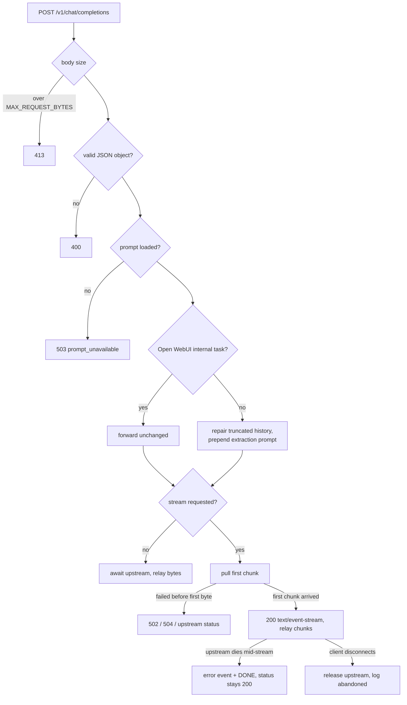

# extractor-proxy

An OpenAI-compatible HTTP proxy that sits between Open WebUI and OpenAI and injects a
system prompt, turning any chat model into a structured data extractor. Paste unstructured
text into the chat; get back a JSON object describing it.

Ships with a Docker Compose stack: Postgres, Open WebUI 0.6.5, and this proxy.

- Prompt and its design: [SYSTEM_PROMPT.md](SYSTEM_PROMPT.md)
- Measured behaviour against a live model: [live-run results](SYSTEM_PROMPT.md#what-the-live-runs-actually-showed)

---

## Requirements

- Docker with Compose v2
- An OpenAI API key with credit
- Ports 3000 and 8000 free on localhost (configurable)

Python 3.11 is only needed to run the test suite outside the container.

## Quick start

```bash
cp .env.example .env          # set OPENAI_API_KEY
docker compose up -d
./scripts/verify.sh
```

First boot takes about a minute — Open WebUI runs migrations and loads embedding models.
When `verify.sh` exits 0, open <http://localhost:3000>, register (the first account becomes
admin), select `gpt-4o-mini`, and paste some text.

---

## Usage

### From the browser

Paste any unstructured text. The reply is a fenced JSON block. Ask a follow-up question
instead of pasting, and the reply is prose citing the extracted fields.

### From the API

The proxy is OpenAI-compatible, so any OpenAI client works against it.

```bash
curl http://localhost:8000/v1/chat/completions \
  -H 'content-type: application/json' \
  -d '{"model":"gpt-4o-mini","messages":[{"role":"user","content":"inv A-4491 total 82.10"}]}'
```

Authentication is not required — the proxy uses its own configured key and ignores any
`Authorization` header you send. It is bound to localhost only.

Add `"stream": true` for a Server-Sent Events response.

`Content-Type: application/json` is required — anything else is refused with `415`. That
is deliberate: without it a `text/plain` POST would be a CORS *simple* request, which any
web page could fire at the loopback port with no preflight and spend the configured key.

### Output format

Every extraction returns these eight keys, always present and always in this order:

| Key | Type | Contents |
| --- | --- | --- |
| `document_type` | string | `invoice`, `receipt`, `email`, … or `unknown` |
| `confidence` | number | 0.00–1.00, for the `document_type` call only |
| `language` | string | ISO 639-1, or `mul` / `und` |
| `summary` | string | one sentence, ≤ 25 words |
| `fields` | object | the extracted data; shape follows the document |
| `uncertain_fields` | array | every field held below 0.90, with a path and a reason |
| `unextracted` | array | source content that mapped to no field |
| `warnings` | array | conditions affecting the extraction |

Inside `fields` the shape varies by document, under fixed conventions: `lower_snake_case`
keys, ISO 8601 dates, money as `{"amount": …, "currency": …}` with an ISO 4217 code,
and `null` for a field the document does not supply rather than an omitted key.

Entries in `uncertain_fields` look like:

```json
{ "path": "fields.totals.total.currency", "confidence": 0.3,
  "reason": "no currency symbol or code anywhere in the document" }
```

Full specification, including the rules for follow-up questions and untrusted source
text, is in [SYSTEM_PROMPT.md](SYSTEM_PROMPT.md).

---

## How it works

```
browser ──▶ Open WebUI ──▶ extractor-proxy ──▶ api.openai.com
                 │                │
                 ▼                └── prepends SYSTEM_PROMPT.md to the messages
              Postgres
```

Open WebUI is configured with `OPENAI_API_BASE_URL=http://middleware:8000/v1`, so it
sends every chat completion here instead of to OpenAI. The proxy prepends the extraction
prompt and forwards the request upstream using its own key. Responses are relayed
unchanged — bytes for streams, verbatim JSON otherwise.

Neither Open WebUI nor the model is modified.

### Request path



Three decisions carry most of the design:

**Internal-task detection.** After every message, Open WebUI asks the model to name the
chat, tag it and suggest searches, using its own prompt templates. Those calls must not
receive the extraction prompt, or chat titles become JSON. Open WebUI strips its own
`metadata.task` label before forwarding, so the proxy matches the template text instead: a
final user message, optionally preceded only by system messages, carrying a recognised
template opening. All eight of Open WebUI 0.6.5's templates are covered.

**Repairing interrupted history.** If a reply is cut off mid-JSON — you press stop, or a
token ceiling hits — Open WebUI stores the fragment and replays it on every later turn.
The proxy detects an assistant turn with an unclosed code fence and replaces it with a
statement that the extraction was interrupted, so a follow-up cannot be answered out of
half-written fields. Only this service's own incomplete output is touched; your text is
never altered.

**The first-chunk pull.** Once `200` and `text/event-stream` are sent, the status code
cannot be changed. So the proxy waits for the first chunk before committing the response:
failures up to that point get a real HTTP status, failures after it are reported as an SSE
error event followed by `[DONE]`. Open WebUI's frontend recognises an `error` key in a
frame and ends the stream cleanly.

### Endpoints

| Method | Path | Returns |
| --- | --- | --- |
| `GET` | `/healthz` | `200` always, while the process can serve |
| `GET` | `/readyz` | `200` ready, or `503` with a per-check breakdown |
| `GET` | `/v1/models` | the configured model list; never calls OpenAI |
| `POST` | `/v1/chat/completions` | the completion, streaming or not |
| `GET` | `/docs`, `/openapi.json` | FastAPI's generated API docs |

`/healthz` checks nothing but the process. `/readyz` checks that the prompt document
loaded and an API key is configured — it deliberately does not call OpenAI, so an upstream
outage does not mark the container unready.

### Status codes on `/v1/chat/completions`

| Code | Condition |
| --- | --- |
| `200` | success, or a mid-stream failure reported in-band |
| `400` | body is not valid JSON, or not a JSON object |
| `413` | body exceeds `MAX_REQUEST_BYTES` |
| `415` | `Content-Type` is not `application/json` |
| `502` | OpenAI unreachable, empty stream, or a non-JSON upstream body |
| `503` | `SYSTEM_PROMPT.md` failed to load |
| `504` | upstream timed out |
| *upstream's* | any other upstream status, relayed with its body intact |

Errors use OpenAI's shape, plus a `request_id` that matches the `x-request-id` response
header and the logs:

```json
{ "error": { "message": "Could not reach OpenAI: …", "type": "upstream_unavailable",
             "code": null, "request_id": "3f2a…" } }
```

---

## Configuration

All settings are environment variables, read from `.env`. Only `OPENAI_API_KEY` has no
usable default.

| Variable | Default | Purpose |
| --- | --- | --- |
| `OPENAI_API_KEY` | — | upstream credential; never sent to Open WebUI or the browser |
| `OPENAI_BASE_URL` | `https://api.openai.com/v1` | upstream base; must not embed credentials |
| `EXPOSED_MODELS` | `gpt-4o-mini` | comma-separated list served by `/v1/models` |
| `MAX_REQUEST_BYTES` | `8388608` | request body ceiling |
| `CONNECT_TIMEOUT_SECONDS` | `10` | connect timeout |
| `READ_TIMEOUT_SECONDS` | `90` | gap allowed *between* streamed chunks |
| `LOG_LEVEL` | `INFO` | root log level |
| `SERVICE_NAME` | `extractor-proxy` | name reported by `/healthz` and in every log line |
| `SYSTEM_PROMPT_PATH` | discovered | set explicitly in the container |
| `HOST` / `PORT` | `0.0.0.0` / `8000` | bind address inside the container |

Timeouts are per-operation, not a total deadline, so a long stream is never cut short as
long as chunks keep arriving.

Compose-only variables: `MIDDLEWARE_PORT` (default `8000`) and `OPEN_WEBUI_PORT`
(default `3000`) set the host ports, both bound to `127.0.0.1`; `POSTGRES_USER` /
`POSTGRES_PASSWORD` / `POSTGRES_DB` configure the database; `MIDDLEWARE_API_KEY` is the
placeholder Open WebUI presents to the proxy; `WEBUI_SECRET_KEY` signs Open WebUI's
session tokens.

> `HOST` and `PORT` are generic names and will pick up any ambient variable of that name.

---

## Logs

One JSON object per line. Every line from a request shares a `request_id`, which also
appears in the `x-request-id` response header and inside any error body.

Nothing here should carry a credential. Redaction runs over the finished line rather than
any one field, so a key-shaped string is masked wherever it turns up — event name,
structured fields, or an exception's text — and the startup line reports the API key as
presence and length instead of value.

```bash
docker compose logs -f middleware
docker compose logs middleware | grep '"request_id":"3f2a"'   # one request, start to end
docker compose logs middleware | grep service.starting        # effective configuration
```

| Event | Level | Meaning |
| --- | --- | --- |
| `service.starting` | INFO | every effective setting; the key appears only as presence and length |
| `service.stopped` | INFO | lifespan teardown |
| `prompt.load.ok` / `.failed` | INFO/ERROR | whether SYSTEM_PROMPT.md parsed, and why not |
| `chat.request` | INFO | model, streaming, request size, message count, whether injected |
| `chat.rejected` | WARN | refused before reaching OpenAI — size, media type, or malformed body |
| `chat.refused` | ERROR | prompt document unavailable |
| `chat.completed` | INFO | `finish_reason`, token usage, `truncated` |
| `chat.stream.finished` | INFO | chunks and bytes forwarded; logged on disconnect too |
| `prompt.injection.applied` | INFO | the prompt was prepended |
| `prompt.injection.skipped` | INFO/WARN | and why — `open_webui_task`, `no_messages`, … |
| `prompt.truncated_history_repaired` | INFO | how many interrupted extractions were replaced |
| `upstream.response` | INFO/WARN | what OpenAI answered |
| `upstream.request.failed` | WARN | could not reach OpenAI |
| `upstream.stream.interrupted` | WARN | upstream died mid-stream |
| `upstream.stream.unterminated` | WARN | stream ended without `[DONE]`; one was appended |
| `upstream.stream.empty` | WARN | 2xx with no body |
| `upstream.stream.abandoned` | INFO | consumer disconnected; upstream released |
| `http.request.start` / `.end` | INFO | lifecycle, with duration and byte count |
| `http.response.start` | INFO | status and time to first byte |
| `http.request.cancelled` | WARN | ended without a normal response |
| `http.request.failed` | ERROR | unhandled exception, with traceback |

Values shaped like API keys are masked in the output regardless of where they came from.

---

## Verifying and testing

`scripts/verify.sh` checks each hop in order and stops at the first failure.

| Check | Proves |
| --- | --- |
| 1–2 | the process is up and configured |
| 3 | `/v1/models` is populated, so the selector will not be empty |
| 4 | a messy document produces the eight-key envelope in order |
| 5 | streaming delivers multiple frames and terminates |
| 6 | Open WebUI's own task calls are *not* injected into |
| 7 | the real key is not in the Open WebUI container; ports are loopback-bound |
| 8 | Open WebUI can reach Postgres |

| Exit | Meaning |
| --- | --- |
| `0` | verified |
| `1` | a hop is broken |
| `2` | the stack is not running |
| `3` | the chain works; OpenAI refused the request (quota, billing, bad key) |

Unit tests:

```bash
cd middleware
uv venv --python 3.11 && uv pip install -e ".[dev]"
.venv/bin/python -m pytest
```

154 tests, no network access. The upstream is faked with `httpx2.MockTransport`, including
streams that fail mid-flight, end without a terminator, and are abandoned by a cancelled
consumer.

---

## Troubleshooting

| Symptom | Cause |
| --- | --- |
| Model dropdown is empty | middleware down or `EXPOSED_MODELS` empty — run `verify.sh` |
| Chats are named with JSON | injection scoping broke; see `verify.sh` check 6 |
| Replies stop halfway | look for `truncated: true` in `chat.completed` |
| Changed a setting, nothing happened | Open WebUI caches config in Postgres; `docker compose down -v` |
| `verify.sh` exits 3 | the OpenAI account, not this stack |
| `/readyz` returns 503 | the response body names the failing check |
| Port already in use | set `MIDDLEWARE_PORT` / `OPEN_WEBUI_PORT` in `.env` |

Inspect the database with `docker compose exec postgres psql -U openwebui -d openwebui`.
Postgres is not published to the host.

---

## Limitations

- Follow-up prose can assert a value the extraction recorded as `null`; the JSON is
  authoritative.
- Source text can attempt to redirect the extraction. It is answered with a rule and a
  warning, but nothing validates the model's output.
- Editing an Open WebUI task template, or bumping its version, can break injection
  scoping silently. `verify.sh` check 6 is the tripwire.
- File uploads go through Open WebUI's retrieval pipeline, so the proxy sees retrieved
  chunks rather than the document. Paste text instead.
- The injected prompt costs roughly 2,900 prompt tokens per request.
- No retries, no rate limiting, no inbound authentication.

## Layout

```
SYSTEM_PROMPT.md         the prompt and its design notes
docker-compose.yml       postgres + open-webui 0.6.5 + middleware
scripts/verify.sh        end-to-end checks
.env.example             every variable
middleware/
  Dockerfile             python:3.11-slim, non-root
  src/extractor_proxy/
    main.py              app factory, lifespan, error handlers
    config.py            settings
    prompt.py            prompt loading, injection, task detection
    upstream.py          the OpenAI client and streaming failure handling
    observability.py     JSON logging and request lifecycle
    errors.py            error envelope
    routes/health.py     /healthz, /readyz
    routes/openai_compat.py  /v1/models, /v1/chat/completions
  tests/
```

---

## Design decisions

Each entry is the choice, the alternative it was taken over, and what it cost.

### A fixed envelope with a document-shaped body

The brief asks for *consistent* JSON and extraction from *any* text. One schema cannot do
both — a shape rigid enough for a medical note and a shipping label is either enormous or
throws most of each document away. So the eight outer keys never vary and everything
document-specific lives in `fields`, under fixed conventions.

**Cost:** only the envelope is truly schema-stable. A consumer wanting a specific field
still has to know the document type.

### Uncertainty as a list of exceptions

The alternative is `{value, confidence}` on every field. That doubles output tokens on a
response the user watches stream, and hides the one `0.41` among forty `0.98`s.

**Cost:** asking "how confident about field X" means searching a list. And an empty array
is a strong claim the model has to actually honour — it did not at first, which is why
the prompt now names nine concrete triggers instead of a confidence threshold. Asking a
model to introspect a number turned out to be close to unactionable.

### The request history is repaired; the response never is

An extraction cut off mid-JSON stays in Open WebUI's history and comes back on every later
turn, and the model would answer follow-ups out of the half-written fragment — citing
field paths it never actually produced. Four attempts to fix that in the prompt failed six
runs out of six. Deleting the fragment worked immediately: an assistant turn with an
unclosed code fence is replaced before the payload goes upstream.

**Cost, and the lesson:** the proxy now edits conversation history, which is a real
liability — the detection is deliberately narrow (assistant turns only, never the user's
text, and only a message carrying a fence that does not close it) precisely because it is
not free. Narrowing it was not free either: an earlier version counted fences and called
the count odd-or-even, which quietly deleted any complete extraction of a document that
quoted a code block of its own. The lesson is the ordering. Some
failures are cheaper to make impossible than to argue the model out of, and an unclosed
fence is a fact about the bytes rather than a judgement the model has to make about its own
history. What kept this in the "limitations" list for so long was a wrong reason written
down early — that fixing it meant validating replayed turns, which the streaming design
rules out. Repairing a *request* has nothing to do with how *responses* stream.

### Responses are relayed, never re-encoded

Streamed chunks are forwarded as opaque bytes; non-streaming bodies go back verbatim.
Parsing would allow richer response logging, but a re-encoding bug corrupts every
response, and OpenAI sends a final chunk with an empty `choices` list that naive parsing
crashes on.

**Cost:** response-side logging is limited to counts and timing, and nothing validates the
model's output shape. The non-streaming path parses a copy for logging only.

### Failures are reported differently either side of the first byte

Once `200` and `text/event-stream` are sent the status cannot be revised, so the proxy
pulls the first chunk *before* committing the response. Everything that fails up to that
point gets a real HTTP status; after it, failures become an in-band SSE error frame plus a
terminator, which Open WebUI's frontend recognises.

**Cost:** a mid-stream failure is an HTTP `200`, and the logs are where the truth lives.
This split turned out to be the highest-leverage structural decision here — most streaming
defects found later were about which side of that line a case fell on.

### A static model list

`/v1/models` is served from configuration with no upstream call, so the selector stays
populated when OpenAI is unreachable and the endpoint is deterministic under test.

**Cost:** it does not reflect the account's real entitlements, so an unreachable model
fails at first chat rather than at selection.

### No inbound authentication, and loopback binding

Open WebUI holds a placeholder key, so validating it proves nothing. Both published ports
are bound to `127.0.0.1` instead.

**Cost, and the lesson:** these are one decision, not two. An earlier version argued "no
auth because it's a local stack" while compose published on `0.0.0.0` — the decision was
fine, the premise was false. Loopback alone also does not exclude the browser, which is
why `application/json` is required (making a cross-origin POST non-simple) and why the
`Host` header is checked. `verify.sh` now asserts the binding rather than trusting a
comment.

### No retries

Retrying a completion risks paying twice, a partially-sent stream cannot be replayed, and
a silently-retrying proxy makes its own latency logs lie.

**Cost:** a transient upstream blip reaches the user as an error.

### SYSTEM_PROMPT.md is the runtime source of truth

The service parses the prompt out of the repository document at startup rather than
holding a copy in Python. The brief requires that document; a constant beside it is free
to drift, and a stale prompt document describes behaviour the service does not have.

**Cost:** a startup file read, a small parser, and a packaging concern — the container
copies the document in and sets `SYSTEM_PROMPT_PATH`, because the path-discovery walk
cannot work from inside site-packages.

### Raw ASGI middleware rather than `BaseHTTPMiddleware`

`BaseHTTPMiddleware` returns control when the response *starts*, which would report a few
milliseconds for a response that streamed for thirty seconds.

**Cost:** more code, and it has to handle ASGI details the framework would otherwise hide.
Both bit at least once — a client disconnect arrives as `CancelledError`, not
`GeneratorExit`, and an unhandled exception is handled outside this middleware entirely.
